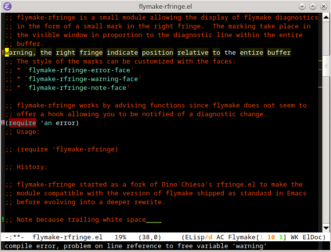

flymake-rfringe.el
==================

flymake-rfringe.el provide a minor mode `flymake-rfringe-mode` which display
flymake diagnostics in the form of a small mark in the right fringe.  The
marking is carried out place in the visible window in proportion to the
diagnostic line in the entire buffer.



The style of the marks can be customized with the faces:
* `flymake-rfringe-error-face'
* `flymake-rfringe-warning-face'
* `flymake-rfringe-note-face'

flymake-rfringe works by advising functions since flymake does not seem to
offer a hook allowing you to be notified of a diagnostic change.

Usage
=====

Turn the mode on/off by `M-x flymake-rfringe-mode`.
To enable this mode each time flymake is enabled:

```lisp
(require 'flymake-rfringe)
(add-hook 'flymake-mode-hook #'flymake-rfringe-mode)
```

History
=======

flymake-rfringe started as a fork of
[rfringe.el](https://www.emacswiki.org/emacs/rfringe.el) by Dino Chiesa to
ensure module compatibility with versions of flymake shipped as standard in
Emacs before evolving towards a deeper rewrite while only keeping the part
related to flymake.
