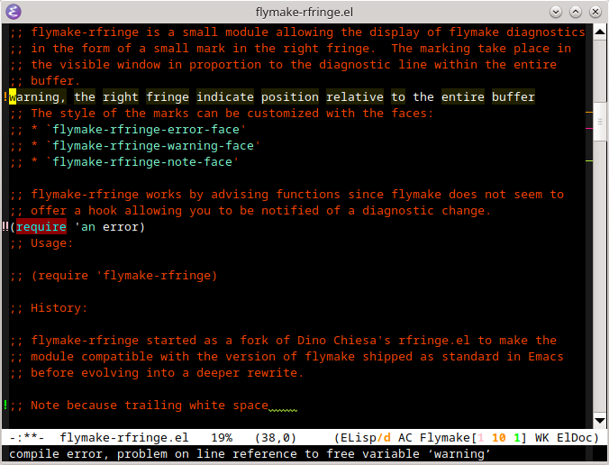

Presentation
============

flymake-rfringe is a small module allowing the display of flymake diagnostics
in the form of a small mark in the right fringe.  The marking take place in
the visible window in proportion to the diagnostic line within the entire
buffer.



The style of the marks can be customized with the faces:
* `flymake-rfringe-error-face'
* `flymake-rfringe-warning-face'
* `flymake-rfringe-note-face'

flymake-rfringe works by advising functions since flymake does not seem to
offer a hook allowing you to be notified of a diagnostic change.

Usage
=====

```lisp
(require 'flymake-rfringe)
```

History
=======

flymake-rfringe started as a fork of Dino Chiesa's rfringe.el to make the
module compatible with the version of flymake shipped as standard in Emacs
before evolving into a deeper rewrite.
